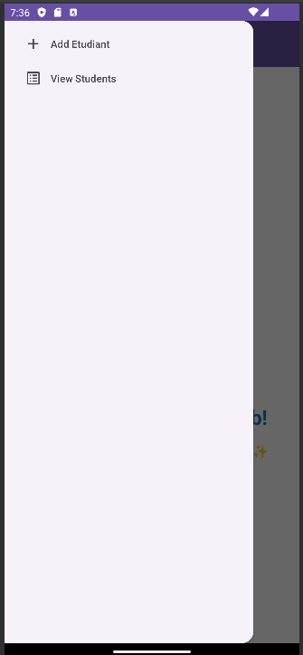

# Application de Gestion des Étudiants

## Vue d'ensemble

Ce projet est une application mobile développée avec **Android Studio** qui facilite la gestion des informations des étudiants. 
Elle permet aux utilisateurs d'ajouter des étudiants, de consulter une liste d'étudiants, de mettre à jour leurs informations et de les supprimer. 
L'application dispose d'une interface conviviale avec un tiroir de navigation (**Drawer**), des fragments pour diverses fonctionnalités, 
et une gestion efficace des données à l'aide de la bibliothèque **Volley** pour les requêtes réseau. 
Le projet inclut également un backend PHP pour gérer le stockage et la récupération des données.

## Fonctionnalités

- **Drawer** : Navigation facile entre les principales fonctionnalités de l'application.
- **Ajouter Étudiant** : Un formulaire pour entrer les détails de l'étudiant, y compris le nom, le prénom, la ville (via un spinner), le sexe (via des boutons radio) et le téléchargement d'une image.
- **Voir les Étudiants** : Une liste affichant tous les étudiants avec leurs détails et images, supportant la fonctionnalité de recherche pour un filtrage facile.
- **Fonctionnalité de Recherche Filtrée** :  Permet aux utilisateurs de rechercher des étudiants par nom, prénom ou ville en temps réel.  
- **Mettre à Jour l'Étudiant** : Modification des détails des étudiants existants à l'aide d'un AlertDialog pour une édition conviviale.
- **Supprimer l'Étudiant** : Fonctionnalité de glisser **Swipe** pour supprimer avec une invite de confirmation pour éviter les suppressions accidentelles.
- **Effets d'Animation** : Animations de fondu en entrée pour une expérience utilisateur visuellement attrayante sur la page d'accueil.

## Technologies Utilisées

- **Android Studio** : Environnement de développement intégré (IDE) pour le développement d'applications Android.
- **Java** : Langage de programmation utilisé pour l'application Android.
- **Volley** : Bibliothèque pour effectuer des requêtes HTTP et gérer la communication réseau.
- **Gson** : Bibliothèque pour convertir des objets Java en JSON et vice versa.
- **Glide** : Bibliothèque de chargement et de mise en cache d'images pour gérer efficacement les images.
- **PHP** : Langage de script côté serveur pour le backend.
- **MySQL** : Système de gestion de base de données pour stocker les données des étudiants.

## Architecture

L'application est structurée en utilisant des **Fragments** au lieu d'Activities, ce qui favorise un design modulaire et une réutilisation. Chaque fonctionnalité est encapsulée dans son propre fragment, permettant une navigation et une gestion d'état plus fluides.

### Composants Principaux

- **HomePageFragment** : Affiche le logo de l'application et un message de bienvenue avec des animations de fondu.
- **AddEtudiantFragment** : Contient le formulaire pour ajouter de nouveaux étudiants.
- **EtudiantListFragment** : Affiche la liste des étudiants avec des fonctionnalités de recherche et de glisser-pour-supprimer.

### Backend PHP

Le backend PHP gère le stockage et la récupération des données via une API RESTful. Il traite les requêtes émises par l'application Android, y compris :

- **Ajout d'étudiants** : Stocke les données des étudiants (y compris les images sous forme de BLOB) dans la base de données MySQL.
- **Récupération des étudiants** : Retourne une réponse JSON contenant les informations des étudiants pour l'affichage dans l'application.
- **Mise à jour et suppression des étudiants** : Gère les modifications et les suppressions des enregistrements d'étudiants.

## Comment Exécuter l'Application

### Application Mobile

1. Clonez ce dépôt sur votre machine locale.
2. Ouvrez le projet dans **Android Studio**.
3. Assurez-vous que les autorisations nécessaires sont définies dans le `AndroidManifest.xml` pour l'accès Internet et le stockage de fichiers.
4. Construisez et exécutez l'application sur un émulateur ou un appareil physique.

### Backend PHP

1. Configurez un environnement de serveur local (par exemple, en utilisant **XAMPP** ou **MAMP**).
2. Importez les fichiers PHP dans le répertoire racine du serveur (par exemple, `htdocs` pour XAMPP).
3. Créez une base de données MySQL et importez le schéma de la base de données fourni.
4. Mettez à jour les URL des points de terminaison API dans l'application Android pour pointer vers votre serveur local.

## Captures d'écran

<table>
  <tr>
    <td>
      
      
L'écran d'accueil de l'application, présentant le logo et une animation d'introduction.

    </td>
    <td>
      
      
Tiroir pour navigation entre les principales fonctionnalités de l'application.

    </td>
  </tr>
  <tr>
    <td>
      
      
Contient le formulaire pour ajouter de nouveaux étudiants.

    </td>
    <td>
      
      
Affiche la liste des étudiants.

    </td>
  </tr>
  <tr>
    <td>
      
      
Gère les modifications des enregistrements d'étudiants.

    </td>
    <td>
      
      
Gère les suppressions des enregistrements d'étudiants.

    </td>
  </tr>
  <tr>
    <td>
      
      
Recherche des étudiants par nom, prénom ou ville en temps réel.

    </td>
    <td></td>
  </tr>
</table>
